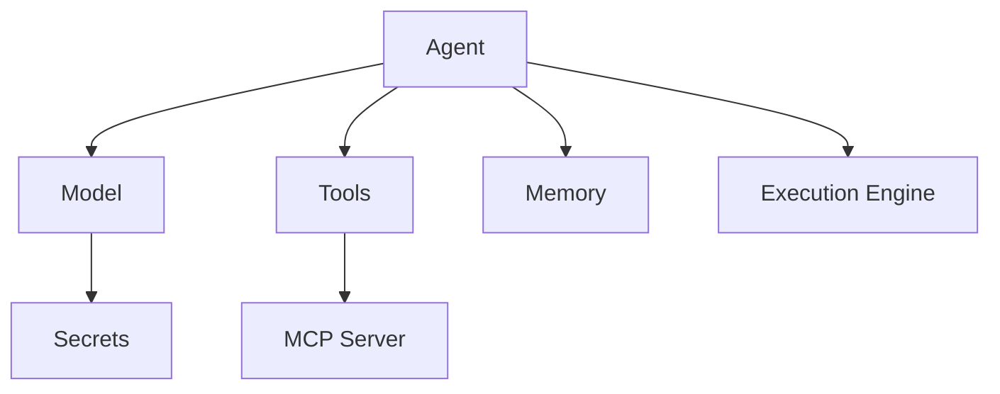
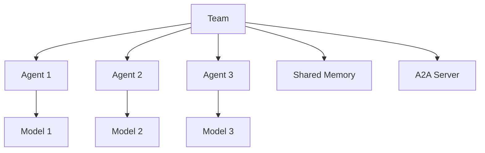
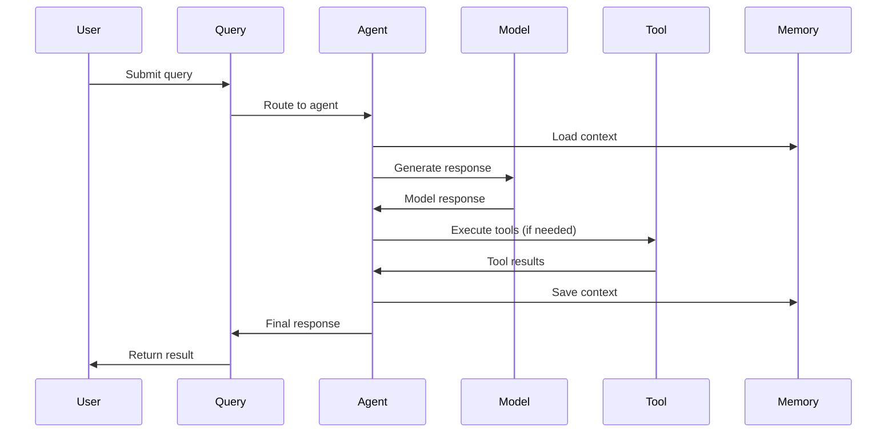

# Resource Relationships

Understanding how ARK resources relate to and interact with each other is crucial for designing effective agentic workflows. This section explains the relationships between different resource types and common patterns for combining them.

## Core Resource Dependencies

### Agent Dependencies
An Agent requires several supporting resources to function:



**Required:**
- **Model**: Defines the AI model provider and configuration
- **Execution Engine**: Runtime environment for the agent

**Optional:**
- **Tools**: External capabilities and functions
- **Memory**: Persistent context storage
- **MCP Servers**: Standardized tool integrations

### Team Dependencies
Teams orchestrate multiple agents and their dependencies:



**Components:**
- **Multiple Agents**: Team members with specific roles
- **Shared Memory**: Optional shared context
- **A2A Server**: Agent-to-agent communication
- **Workflow Definition**: Coordination patterns

## Common Patterns

### Single Agent Pattern
The simplest pattern with one agent handling specific tasks:

```yaml
# Model
apiVersion: ark.mckinsey.com/v1alpha1
kind: Model
metadata:
  name: gpt-4-model
spec:
  provider: openai
  type: openai
  model:
    value: gpt-4

---
# Agent
apiVersion: ark.mckinsey.com/v1alpha1
kind: Agent
metadata:
  name: weather-agent
spec:
  model: gpt-4-model
  systemPrompt: "You are a helpful weather assistant"
  tools:
    - weather-tool
```

### Multi-Agent Team Pattern
Multiple agents collaborating on complex tasks:

```yaml
# Team with multiple specialized agents
apiVersion: ark.mckinsey.com/v1alpha1
kind: Team
metadata:
  name: research-team
spec:
  agents:
    - name: researcher
      agent: research-agent
      role: "Primary researcher"
    - name: analyst
      agent: analysis-agent
      role: "Data analyst"
    - name: writer
      agent: writing-agent
      role: "Report writer"
  workflow:
    type: sequential
  memory:
    enabled: true
    shared: true
```

### Tool-Enhanced Agent Pattern
Agents with external capabilities through tools:

```yaml
# Tool definition
apiVersion: ark.mckinsey.com/v1alpha1
kind: Tool
metadata:
  name: weather-tool
spec:
  type: function
  function:
    name: get_weather
    description: "Get current weather"
    implementation:
      type: http
      http:
        url: "https://api.weather.com/v1/current"

---
# Agent using the tool
apiVersion: ark.mckinsey.com/v1alpha1
kind: Agent
metadata:
  name: weather-agent
spec:
  model: gpt-4-model
  tools:
    - weather-tool
```


## Query Execution Flow

Understanding how queries flow through the system:



### Query Lifecycle
1. **Submission**: User submits query via CLI or API
2. **Routing**: Query routed to target agent or team
3. **Context Loading**: Agent loads relevant memory/context
4. **Processing**: Model generates response
5. **Tool Execution**: External tools called if needed
6. **Context Saving**: Updated context saved to memory
7. **Response**: Final response returned to user

## Resource Lifecycle Management

### Creation Order
When creating related resources, follow this order:

1. **Secrets** (API keys, credentials)
2. **Models** (AI model configurations)
3. **Memory** (if using persistent context)
4. **Tools** (external capabilities)
5. **MCP Servers** (if using MCP tools)
6. **Execution Engines** (runtime environments)
7. **Agents** (individual AI agents)
8. **Teams** (multi-agent orchestration)
9. **A2A Servers** (agent communication)

### Dependency Validation
ARK validates dependencies automatically:

```yaml
status:
  conditions:
  - type: Ready
    status: "False"
    reason: ModelNotFound
    message: "Referenced model 'gpt-4-model' not found"
```

### Cleanup and Deletion
When deleting resources, consider dependencies:

```bash
# Safe deletion order (reverse of creation)
kubectl delete teams --all
kubectl delete agents --all
kubectl delete tools --all
kubectl delete models --all
kubectl delete secrets --all
```

## Advanced Patterns

### Multi-Model Agent
Agent that can use different models for different tasks:

```yaml
# Future pattern - model selection based on context
apiVersion: ark.mckinsey.com/v1alpha1
kind: Agent
metadata:
  name: adaptive-agent
spec:
  modelSelector:
    default: gpt-4-model
    rules:
    - condition: "query.type == 'code'"
      model: code-specialized-model
    - condition: "query.complexity == 'simple'"
      model: gpt-3.5-model
```

### Hierarchical Teams
Teams containing other teams:

```yaml
# Parent team
apiVersion: ark.mckinsey.com/v1alpha1
kind: Team
metadata:
  name: organization
spec:
  teams:
    - research-team
    - development-team
    - qa-team
  workflow:
    type: parallel
```

### Cross-Namespace Resources
Resources spanning multiple namespaces:

```yaml
# Agent in one namespace using model from another
apiVersion: ark.mckinsey.com/v1alpha1
kind: Agent
metadata:
  name: app-agent
  namespace: application
spec:
  model: shared-models/gpt-4-model  # Cross-namespace reference
```

## Monitoring Relationships

### Resource Status
Monitor the health of resource relationships:

```bash
# Check agent dependencies
kubectl describe agent weather-agent

# Verify model connectivity
ark check models

# Monitor team coordination
ark describe team research-team
```

### Troubleshooting Dependencies
Common dependency issues and solutions:

```bash
# Model not ready
kubectl get models
# Solution: Check API keys and connectivity

# Tool not available
kubectl get tools
# Solution: Verify tool implementation and MCP servers

# Memory not accessible
kubectl get memory
# Solution: Check database connectivity and credentials
```

